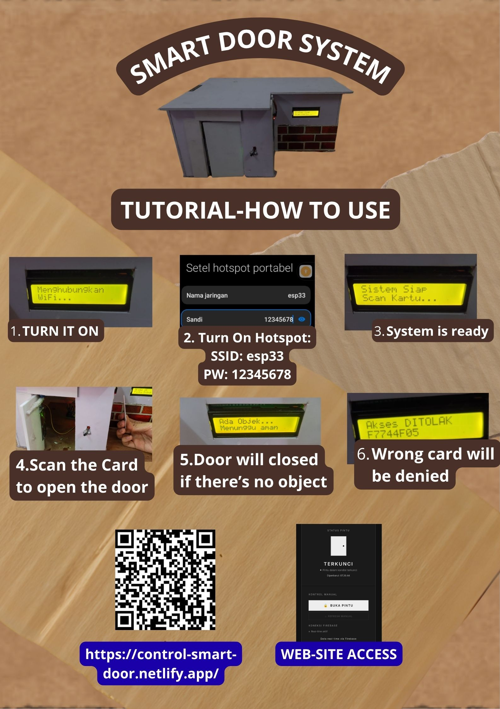

# 🔐 Smart Door Lock

An RFID-based smart door lock system developed using **ESP32**, **RFID**, **Firebase**, and a web-based control system.

This project was developed as a technology project to learn how hardware, cloud database, and web-based control can be integrated into an automated access control system.

---

## 📌 Overview

The system provides two ways to control the door:

1. **RFID Card**
2. **Web-based Control**

When an authorized RFID card is detected, the ESP32 verifies the card and automatically unlocks the door.

The door can also be controlled remotely through a web interface connected to Firebase.

The system records access events and maintains basic usage statistics.

## 📷 Project Poster



---

## ✨ Features

* 🔑 RFID-based access control
* 🌐 Web-based door control
* 🔒 Automatic door locking
* 📊 Access event logging
* 📈 Basic access statistics
* 🕒 Automatic timestamp using NTP
* 📟 LCD status display
* 🚪 Servo motor door control
* 👤 IR sensor for object/person detection
* ☁️ Firebase Realtime Database integration

---

## 🏗️ System Architecture

```text
                    ┌─────────────────┐
                    │   Web Interface │
                    └────────┬────────┘
                             │
                             ▼
                    ┌─────────────────┐
                    │ Firebase RTDB   │
                    └────────┬────────┘
                             │
                             ▼
┌─────────────┐       ┌─────────────────┐
│ RFID RC522  │──────►│      ESP32      │
└─────────────┘       └────────┬────────┘
                               │
                 ┌─────────────┼─────────────┐
                 ▼             ▼             ▼
             ┌───────┐     ┌───────┐    ┌─────────┐
             │ Servo │     │  LCD  │    │IR Sensor│
             └───────┘     └───────┘    └─────────┘
```

---

## 🛠️ Hardware

* ESP32
* RFID RC522
* Servo Motor SG90
* LCD 16x2 I2C
* IR Sensor
* LED
* Jumper wires
* Supporting electronic components

---

## 💻 Technologies

* C/C++ for Arduino
* Arduino IDE
* ESP32
* RFID / RC522
* Firebase Realtime Database
* I2C
* NTP
* Basic web integration

---

## 📊 Data & Logging

The system stores access-related information in Firebase.

Example data structure:

```text
Firebase Realtime Database
│
├── door
│   ├── status
│   ├── command
│   └── lastEvent
│
├── logs
│   ├── event
│   ├── source
│   ├── note
│   ├── uid
│   ├── rawTime
│   └── time
│
└── stats
    ├── total
    ├── web
    └── rfid
```

The collected information can be used to analyze:

* Total access attempts
* RFID vs web-based access
* Accepted and rejected RFID access
* Access timestamps
* System usage patterns

---

## 🔄 Access Flow

```text
RFID Card
    │
    ▼
Read UID
    │
    ▼
Check Authorized UID
    │
    ├── Authorized ──► Open Door
    │                      │
    │                      ▼
    │                 Record Event
    │                      │
    │                      ▼
    │                 Lock Door
    │
    └── Unauthorized ─► Access Denied
                           │
                           ▼
                       Record Event
```

---

## 🔐 Security Note

Sensitive configuration values are intentionally replaced with placeholders in the public source code.

The following information is **not included**:

* Wi-Fi password
* Firebase credentials
* Private RFID card identifiers

Before running the project locally, replace the placeholder values with your own configuration.

---

## 📚 What I Learned

Through this project, I learned about:

* ESP32 programming
* RFID access control
* Sensor integration
* Servo motor control
* I2C communication
* Firebase Realtime Database
* Cloud-based data storage
* Event logging
* Basic data collection and statistics
* Hardware troubleshooting
* Integrating hardware and software into one system

---

## 🚧 Project Status

**Prototype / Development**

The project is a working prototype and can be further developed with additional security, authentication, and data analysis features.

---

## 👨‍💻 Author

**Marvel Giusepe Iola Permana**

Student at **SMK Nusaputera 1 Semarang**
Computer and Network Engineering (TKJ)

📧 [marpel1250@gmail.com](mailto:marpel1250@gmail.com)
